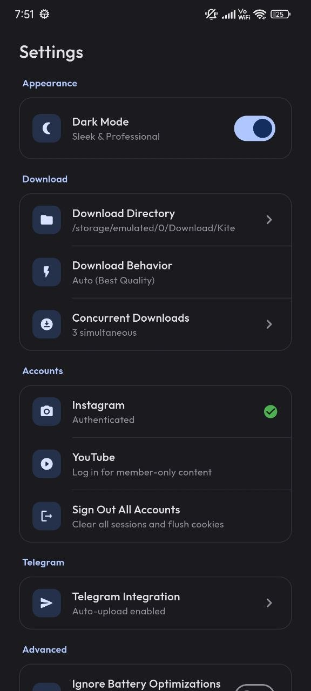
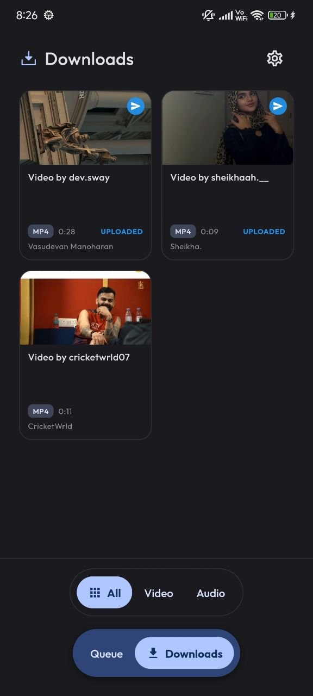
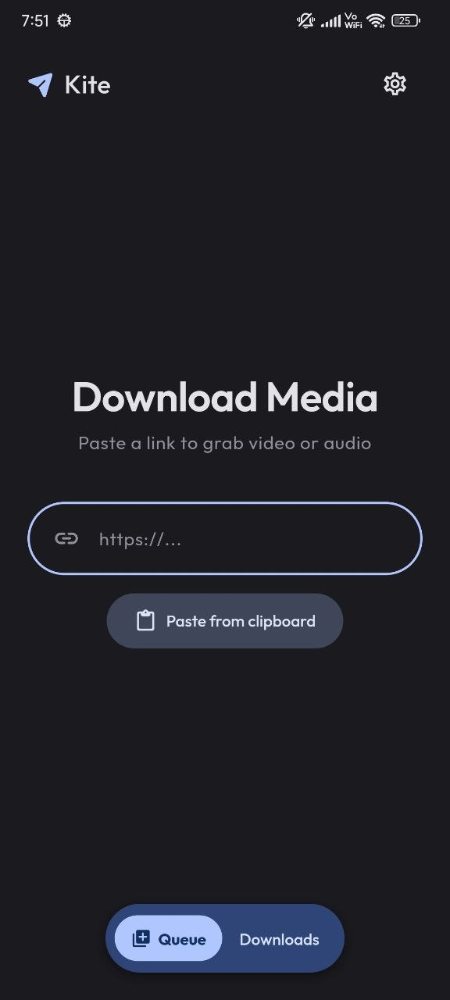
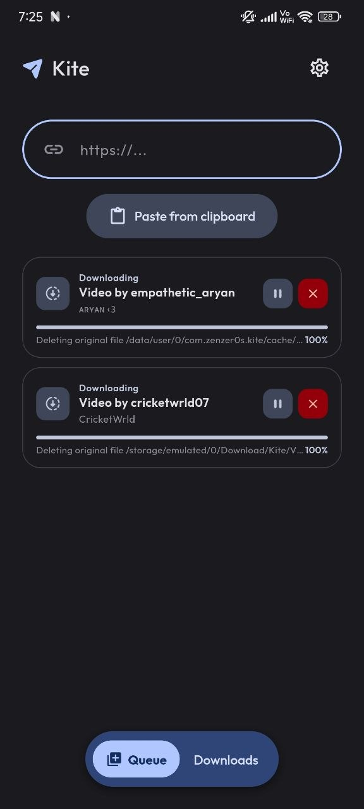
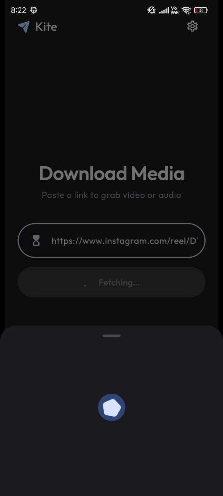
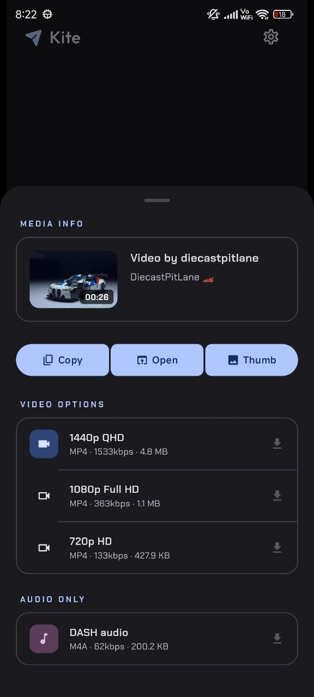

# Kite

### A Modern Video & Audio Downloader for Android

---

## 📱 Screenshots

 

## ✨ Unique Features

### 🍪 Cookie-Based Authentication
Kite features a built-in secure WebView to extract and sync session cookies natively.
- **Purpose**: Access restricted content, download from **private accounts** (Instagram/YouTube), and bypass age or region playback restrictions that typically block standard downloaders.

### 🤖 Telegram Integration
Seamlessly connect your Telegram account with Kite to extend your downloading capabilities and storage.
- **Purpose**: Automatically send your downloaded files to Telegram to be used as **unlimited cloud storage**. This allows you to access your downloads from any device at any time, without consuming local storage or paying for a cloud service.

## 🚀 Features

- **Multi-Platform Support**: Download from hundreds of sites using the latest [yt-dlp](https://github.com/yt-dlp/yt-dlp) core.
- **Premium Quality**: Support for **4K/8K** video resolutions and high-bitrate audio (MP3/M4A/OPUS).
- **Expressive UI**: A vibrant **Material 3** interface with fluid transitions and dynamic color support.
- **Advanced Queue**: Efficiently manage your download history and active tasks with background processing.
- **Core Updates**: Keep your downloading engine up-to-date with one-tap yt-dlp binary updates.

## 🛠️ Tech Stack

- **Framework**: [Flutter](https://flutter.dev)
- **State Management**: [Riverpod](https://riverpod.dev)
- **Database**: [Drift](https://drift.simonbinder.eu/) (SQLite)
- **Core Engine**: [yt-dlp](https://github.com/yt-dlp/yt-dlp) via [youtubedl-android](https://github.com/yausername/youtubedl-android)
- **Theming**: Material 3 with Dynamic Color implementation.

## 🧱 Credits

Kite leverages the powerful core libraries from the [Seal](https://github.com/JunkFood02/Seal) project to provide a robust downloading experience.

- [yt-dlp](https://github.com/yt-dlp/yt-dlp) - The powerhouse behind video extraction.
- [youtubedl-android](https://github.com/yausername/youtubedl-android) - Native Android wrapper for yt-dlp.
- [Seal](https://github.com/JunkFood02/Seal) - For the core logic and architectural foundation.

## 📃 License

This project is licensed under the **GPLv3 License**.

---

<table><td>
<a href="#kite">👆 Scroll to top</a>
</td></table>

